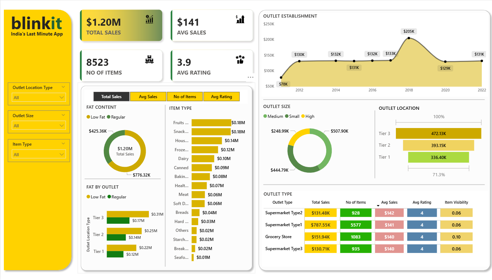

# Blinkit-Sales-Analysis-Dashboard-
Project Overview

The Blinkit Sales Dashboard is a comprehensive Power BI project developed to analyze and monitor retail sales performance across multiple outlet categories, locations, and product segments. The dashboard transforms raw retail data into meaningful business insights through interactive visualizations and KPI-driven analytics.

This project focuses on evaluating sales trends, outlet performance, product category contribution, customer ratings, and inventory distribution. The dashboard is designed to support business stakeholders, analysts, and decision-makers in identifying growth opportunities and improving operational efficiency through data-driven strategies.

Project Objectives

The primary objectives of this dashboard are:

To monitor overall business sales performance
To analyze outlet-level sales distribution
To identify top-performing product categories
To evaluate customer ratings and average sales metrics
To compare outlet performance across different outlet sizes and locations
To provide interactive filtering and dynamic analysis capabilities
Technology Stack

The dashboard was developed using the following technologies and tools:

Power BI Desktop

Used as the primary data visualization and dashboard development platform.

Power Query

Used for data cleaning, transformation, and preprocessing to ensure data quality and consistency.

DAX (Data Analysis Expressions)

Implemented for creating calculated measures, KPIs, conditional logic, and dynamic visual calculations.

Data Modeling

Relationships were established between multiple tables to enable efficient filtering, aggregation, and cross-analysis.

File Formats
.pbix for Power BI development files
.png for dashboard preview and documentation
Data Source

The dataset used in this project contains retail and grocery sales data related to Blinkit outlets. The data includes detailed information regarding:

Product categories
Outlet establishment years
Outlet sizes
Outlet locations
Item visibility
Customer ratings
Sales performance metrics
Fat content categories

The dataset was structured to support multidimensional analysis across products, outlets, and customer-related metrics.

Dashboard Features and Analysis
KPI Summary

The dashboard presents key business metrics to provide a quick overview of overall performance:

Total Sales: $1.20M
Average Sales: $141
Number of Items: 8523
Average Rating: 3.9

These KPIs help users instantly evaluate business performance and operational status.

Outlet Establishment Trend Analysis

A line chart visualization is used to analyze sales trends based on outlet establishment years.

Key Insights
Significant sales growth is visible across multiple years
The highest sales performance was observed around 2018
Helps identify periods of strong business expansion
Fat Content Analysis

A donut chart visualizes the sales contribution of products based on fat content categories:

Low Fat
Regular
Key Insights
Regular fat products contribute a larger share of total sales
Helps understand consumer purchasing preferences
Item Type Performance Analysis

A horizontal bar chart is used to compare sales across multiple product categories such as:

Fruits and Vegetables
Snack Foods
Household Products
Frozen Foods
Dairy Products
Bakery Items
Key Insights
Fruits and snack foods generate the highest sales
Lower-performing categories can be targeted for improvement strategies
Outlet Size Analysis

A donut chart compares sales distribution across outlet sizes:

Small
Medium
High
Key Insights
Medium-sized outlets contribute the highest revenue share
Supports business expansion and investment decisions
Outlet Location Analysis

A funnel chart visualizes sales performance across outlet tiers:

Tier 1
Tier 2
Tier 3
Key Insights
Tier 3 outlets generate the highest sales
Provides insights into regional business performance
Outlet Type Comparison

A detailed performance table compares outlet types based on:

Total Sales
Number of Items
Average Sales
Customer Ratings
Item Visibility

Outlet types analyzed include:

Grocery Store
Supermarket Type 1
Supermarket Type 2
Supermarket Type 3
Key Insights
Supermarket Type 1 contributes the highest total sales
Grocery stores maintain strong product visibility metrics
Business Impact

The dashboard provides valuable business insights that can support strategic decision-making in several areas:

Sales Optimization

Helps identify high-performing outlets and product categories to improve revenue generation.

Inventory Management

Supports better inventory planning by understanding product demand patterns.

Regional Expansion Strategy

Outlet location analysis helps identify profitable regions for future expansion.

Customer Experience Monitoring

Customer rating analysis enables businesses to track service quality and customer satisfaction.

Data-Driven Decision Making

Transforms complex retail data into actionable insights through interactive visual analytics.

Dashboard Preview
Main Dashboard

